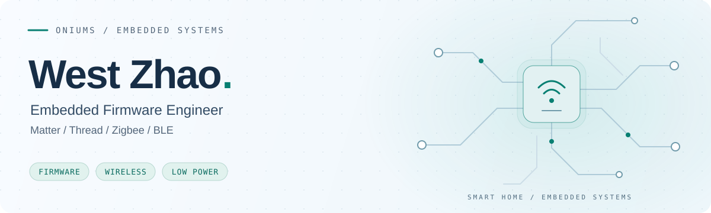
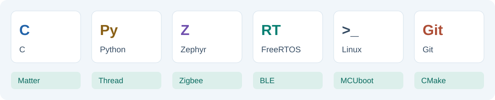
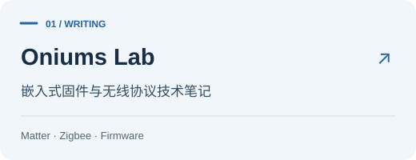
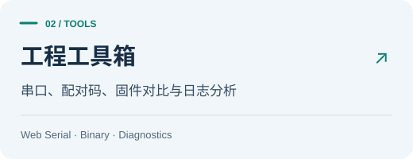
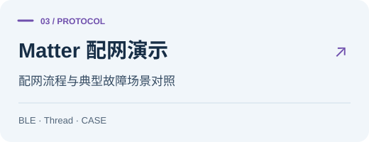
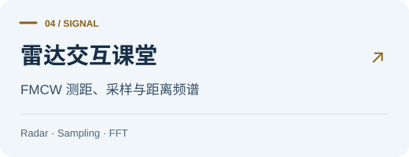
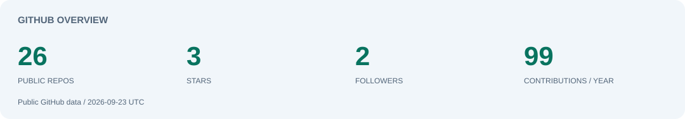
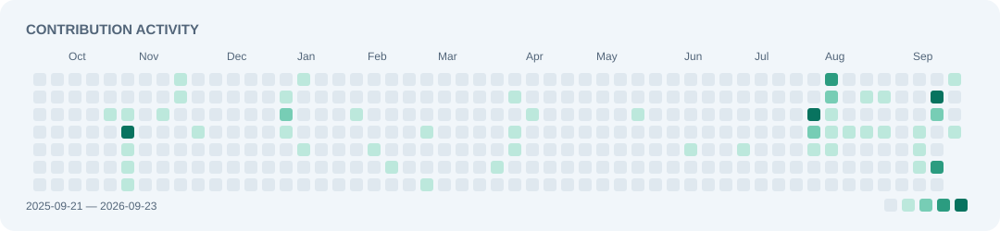

  <picture>
    <source media="(prefers-color-scheme: dark) and (max-width: 600px)" srcset="./assets/profile-header-compact.svg">
    <source media="(prefers-color-scheme: dark)" srcset="./assets/profile-header.svg">
    <source media="(max-width: 600px)" srcset="./assets/profile-header-compact-light.svg">
    
  </picture>

  <a href="https://oniums.github.io/"><b>Blog</b></a>
  &nbsp; / &nbsp;
  <a href="https://oniums.github.io/tools/">Tools</a>
  &nbsp; / &nbsp;
  <a href="https://github.com/Oniums?tab=repositories">Repositories</a>
  &nbsp; / &nbsp;
  <a href="https://oniums.github.io/about/">About</a>

### About

嵌入式固件工程师，常驻深圳，主要从事智能家居与无线设备开发。

- **方向** · Matter over Thread、Zigbee、BLE、低功耗与 OTA
- **开发** · 驱动与应用、协议调试、设备兼容、工程工具
- **分享** · [技术文章](https://oniums.github.io/archives/)与[项目记录](https://oniums.github.io/projects/)

### Tech Stack

  <picture>
    <source media="(prefers-color-scheme: dark) and (max-width: 600px)" srcset="./assets/tech-stack-compact.svg">
    <source media="(prefers-color-scheme: dark)" srcset="./assets/tech-stack.svg">
    <source media="(max-width: 600px)" srcset="./assets/tech-stack-compact-light.svg">
    
  </picture>

### Projects

  <a href="https://oniums.github.io/"><picture><source media="(prefers-color-scheme: dark)" srcset="./assets/project-blog.svg"></picture></a>
  <a href="https://oniums.github.io/tools/"><picture><source media="(prefers-color-scheme: dark)" srcset="./assets/project-tools.svg"></picture></a>
  <a href="https://oniums.github.io/playground/commissioning/"><picture><source media="(prefers-color-scheme: dark)" srcset="./assets/project-commissioning.svg"></picture></a>
  <a href="https://oniums.github.io/playground/radar/"><picture><source media="(prefers-color-scheme: dark)" srcset="./assets/project-radar.svg"></picture></a>

### GitHub Activity

  <a href="https://github.com/Oniums?tab=repositories">
    <picture>
      <source media="(prefers-color-scheme: dark) and (max-width: 600px)" srcset="./assets/github-overview-compact.svg">
      <source media="(prefers-color-scheme: dark)" srcset="./assets/github-overview.svg">
      <source media="(max-width: 600px)" srcset="./assets/github-overview-compact-light.svg">
      
    </picture>
  </a>

  <a href="https://github.com/Oniums?tab=overview">
    <picture>
      <source media="(prefers-color-scheme: dark) and (max-width: 600px)" srcset="./assets/github-activity-compact.svg">
      <source media="(prefers-color-scheme: dark)" srcset="./assets/github-activity.svg">
      <source media="(max-width: 600px)" srcset="./assets/github-activity-compact-light.svg">
      
    </picture>
  </a>

<!-- Statistics: python3 scripts/update-profile.py; scheduled daily after publication. -->
